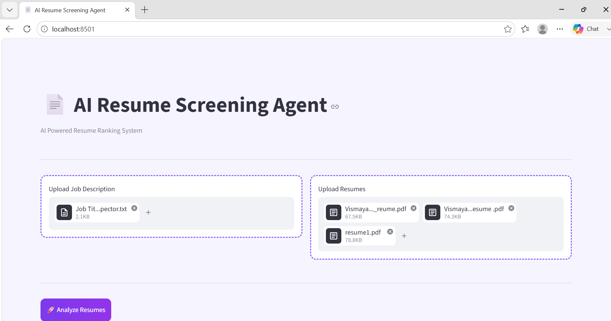
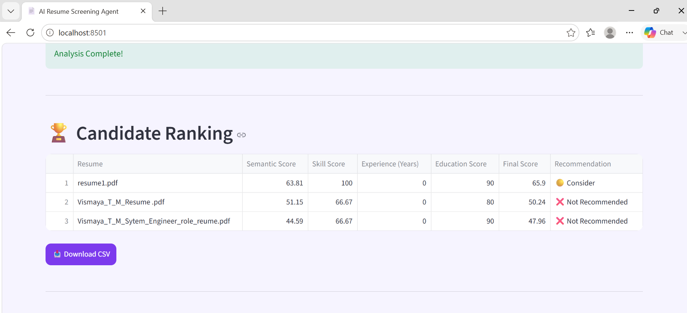
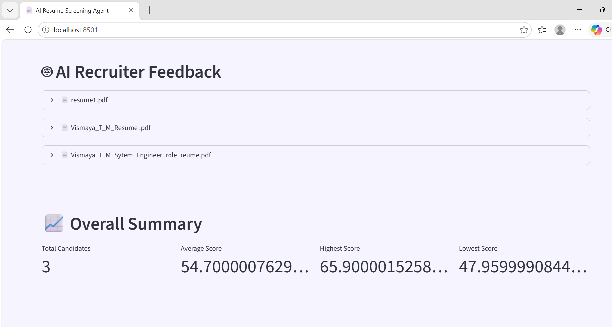
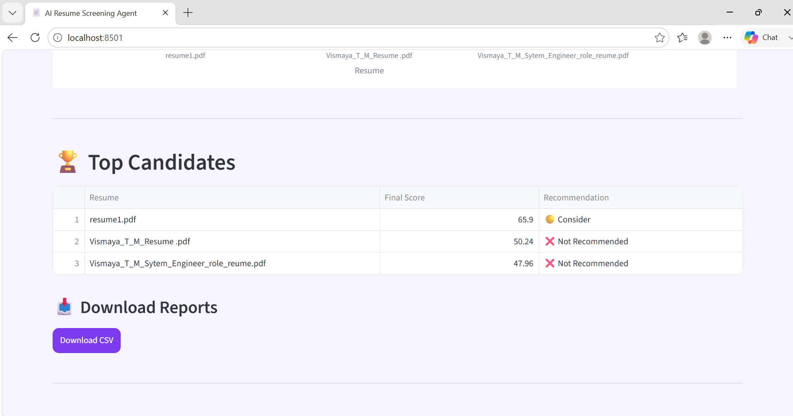

# 🤖AI Resume Screening Agent

An AI-powered Resume Screening and Candidate Ranking System that automatically analyzes resumes against job descriptions using **ATS scoring, NLP-based semantic matching, skill analysis, and LLM-powered recruiter feedback**.

The system helps recruiters quickly identify the most suitable candidates by evaluating resumes, ranking applicants, and generating detailed AI insights.

---

# 📌 Project Overview

Traditional resume screening is time-consuming and often requires manual comparison between resumes and job requirements.

This project automates the hiring workflow by:

- Extracting resume information
- Understanding job requirements
- Calculating ATS compatibility scores
- Matching candidate skills
- Evaluating experience and education
- Generating AI recruiter feedback
- Ranking candidates automatically

---

# 🚀 Features

## 📄 Resume Processing

✅ Upload multiple resumes  
✅ Supports PDF, DOCX, and TXT files  
✅ Automatic text extraction  
✅ Resume content analysis  


## 🎯 ATS Score Calculation

The system evaluates candidates based on:

- Semantic similarity with Job Description
- Skill matching
- Experience relevance
- Education qualification

Final ATS score is calculated using weighted scoring:

```
Final Score =
Semantic Score (50%)
+
Skill Score (25%)
+
Experience Score (15%)
+
Education Score (10%)
```

---

## 🧠 AI Resume Analysis

Powered by LLM-based analysis to generate:

✅ Candidate strengths  
✅ Weaknesses  
✅ Missing skills  
✅ Recruiter summary  
✅ Overall match percentage  


---

## 🏆 Candidate Ranking

Automatically ranks candidates based on final ATS score.

Features:

- Candidate leaderboard
- Top candidate identification
- Score comparison
- Recommendation generation


---

## 📊 Analytics Dashboard

Interactive visualizations include:

- ATS Score comparison
- Recommendation distribution
- Score distribution
- Experience analysis
- Skill score comparison
- Semantic score analysis
- Candidate radar profile


---

## 📥 Report Generation

Export candidate results:

✅ CSV reports  
✅ Excel reports  
✅ PDF reports  


---

# 🏗️ System Architecture

```
                 User
                  |
                  |
          Upload Resume + JD
                  |
                  |
        ---------------------
        |                   |
 Resume Parser        JD Analyzer
        |                   |
        ---------------------
                  |
                  |
          Feature Extraction
                  |
     ----------------------------
     |            |             |
  Skills     Experience    Education
     |
     |
 Semantic Matching Model
     |
     |
 ATS Score Calculation
     |
     |
 LLM Resume Analysis
     |
     |
 Candidate Ranking
     |
     |
 Dashboard + Reports
```

---

# 🛠️ Tech Stack

## Programming Language

- Python


## Frontend

- Streamlit


## AI / Machine Learning

- NLP
- Sentence Transformers
- Semantic Similarity
- Large Language Models


## Libraries

- Pandas
- NumPy
- Plotly
- PyPDF
- python-docx


## AI Integration

- Groq LLM API


## Data Processing

- Resume Parsing
- Text Extraction
- Skill Matching
- ATS Evaluation


---
# 📸 Application Screenshots

## 🏠 Resume Screening Dashboard

Upload a Job Description and multiple resumes to start the AI-powered screening process.




---

## 🏆 Candidate Ranking

The system automatically ranks candidates based on ATS score, skill match, experience, and semantic similarity.




---

## 📊 Analytics Dashboard

Interactive charts provide insights into:

- ATS score comparison
- Skill scores
- Experience analysis
- Recommendation distribution
- Candidate performance


---

## 🤖 AI Recruiter Feedback

The AI generates detailed recruiter insights including:

- Candidate strengths
- Weaknesses
- Missing skills
- Overall recommendation
- Resume summary




---

## 📥 Report Export

Recruiters can download candidate analysis reports in CSV format for further evaluation.


# 📂 Project Structure

```
resume-screening-agent/

│
├── app.py                 # Main Streamlit application
│
├── parser.py              # Resume text extraction
│
├── scorer.py              # Semantic scoring logic
│
├── ats.py                 # ATS evaluation functions
│
├── utils.py               # Skills and recommendation utilities
│
├── llm.py                 # AI resume analysis
│
├── charts.py              # Dashboard visualizations
│
├── report.py              # PDF/Excel report generation
│
├── style.css              # Custom UI styling
│
├── requirements.txt       # Dependencies
│
└── README.md
```

---

# ⚙️ Installation & Setup

## 1. Clone Repository

```bash
git clone https://github.com/vismaya418/resume-screening-agent.git
```

Move into project folder:

```bash
cd resume-screening-agent
```

---

## 2. Create Virtual Environment

```bash
python -m venv venv
```

Activate environment:

### Windows

```bash
venv\Scripts\activate
```

### Linux/Mac

```bash
source venv/bin/activate
```

---

## 3. Install Dependencies

```bash
pip install -r requirements.txt
```

---

# 🔑 Environment Setup

Create a `.env` file:

```
GROQ_API_KEY=your_api_key_here
```

Add your Groq API key to enable AI analysis.

---

# ▶️ Run Application

Start Streamlit:

```bash
streamlit run app.py
```

The application will open in your browser:

```
http://localhost:8501
```

---

# 📸 Application Screenshots

Add screenshots here:

```
assets/

├── upload.png
├── ranking.png
├── dashboard.png
└── ai_feedback.png
```

Example:


---

# 📈 Workflow

```
Upload Job Description
          |
          ↓
Upload Candidate Resumes
          |
          ↓
Extract Resume Text
          |
          ↓
Analyze Skills & Experience
          |
          ↓
Calculate ATS Score
          |
          ↓
Generate AI Feedback
          |
          ↓
Rank Candidates
          |
          ↓
Generate Reports
```

---

# 🎯 Future Enhancements

Planned improvements:

- [ ] User authentication
- [ ] Database integration
- [ ] Resume history tracking
- [ ] Recruiter dashboard
- [ ] Multiple job role templates
- [ ] Email candidate communication
- [ ] Cloud deployment
- [ ] Advanced AI interview questions


---

# 💡 Use Cases

This project can help:

- HR teams
- Recruitment agencies
- Startups
- Career platforms
- College placement cells


---

# 👩‍💻 Author

**Vismaya T M**

Computer Science Engineering Student

GitHub:
https://github.com/vismaya418


---

# ⭐ Support

If you find this project useful, consider giving it a ⭐ on GitHub.

---

# 📜 License

This project is open-source and available under the MIT License.
